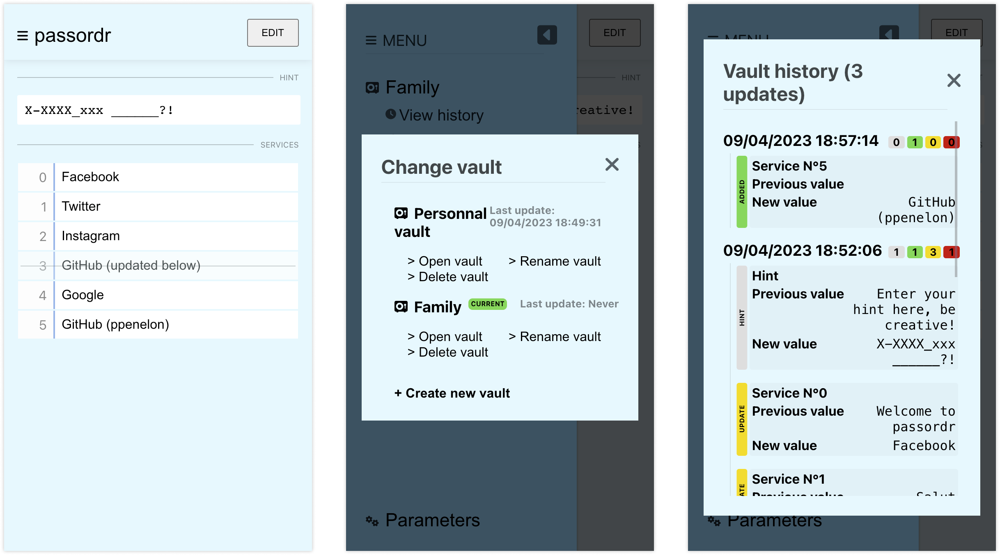

# passordr

Passwords management app without storing any password

## Features

- Open source (made with React using Vite / Zustand)
- Store and remember your passwords with a hint
- List your accounts in numerical order
- Store your data locally (using localStorage)
- Multiple vaults management
- Vault history timeline
- 0 raw password saved

## Incoming

- Server synchronization (via Drive, S3)
- PWA
- Search
