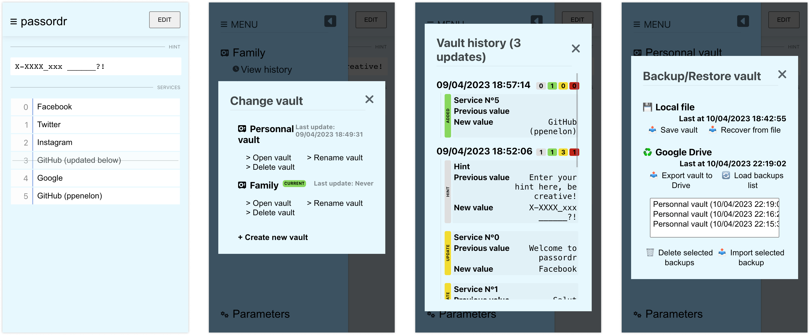

# passordr

Passwords management app without storing any password

## Features

- Store and remember your passwords with a hint
- List your accounts in numerical order
- Multiple vaults management
- Vault history timeline
- Backup and restore your vaults using Google Drive or local files
- 0 raw password saved

## How it's made

- Store your data locally (using localStorage)
- Open source (made with React using Vite / Zustand)
- Full browser code (even Google Drive communication)

## Incoming

- PWA
- Search
